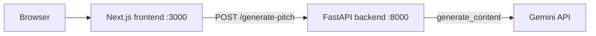

# Find the story


A small tool that takes a musician's bio or update and finds the newsworthy
angle in it, then drafts a pitch email a journalist would actually open.

Built as a scoped demo of AI-directed development: Python/FastAPI backend +
Next.js/TypeScript frontend, calling the Gemini API to do the actual
angle-finding and drafting. Runs with a single `docker compose up`, with
automated tests and CI on every pull request.

See [`SPEC.md`](./SPEC.md) for the one-page spec this was built from.

## Why music

Real Pathos use case, scoped to a domain I actually know: a violinist's bio,
release, or performance update, in this repo's example.

## How it works



1. You paste a bio (20 to 4000 characters) into the frontend.
2. The frontend sends it to `POST /generate-pitch` on the backend.
3. The backend asks Gemini for 2-3 newsworthy angles and one draft pitch email,
   validates the JSON it gets back, and returns it.
4. The frontend shows the angles and a copyable draft.

The backend also exposes `GET /health`, and FastAPI's interactive API docs are
at http://localhost:8000/docs when it's running.

## Quick start (Docker)

You need Docker Desktop and a free Gemini API key from
https://aistudio.google.com/apikey (no card required).

```bash
cp .env.example .env        # then paste your key after GEMINI_API_KEY=
docker compose up --build
```

Open http://localhost:3000, paste a bio, click **Find the angles**.
Stop with `Ctrl+C`.

## Running without Docker

### Backend

```bash
cd backend
pip install -r requirements.txt
export GEMINI_API_KEY=your-key-here
uvicorn main:app --reload --port 8000
```

### Frontend

```bash
cd frontend
npm install
npm run dev
```

The frontend talks to http://localhost:8000 by default. To point it somewhere
else, set `NEXT_PUBLIC_API_URL` before running.

## Configuration

| Variable              | Used by  | Purpose                                                         |
| --------------------- | -------- | --------------------------------------------------------------- |
| `GEMINI_API_KEY`      | backend  | Required. Your Google AI Studio key.                            |
| `CORS_ORIGINS`        | backend  | Comma-separated allowed browser origins. Default: `http://localhost:3000` |
| `NEXT_PUBLIC_API_URL` | frontend | Backend URL. Baked in at build time. Default: `http://localhost:8000` |

## Tests

Neither test suite needs an API key. The backend tests mock the Gemini
responses, and the frontend tests mock `fetch`.

```bash
cd backend && pytest      # API validation, response shape, error handling
cd frontend && npm test   # Jest + React Testing Library: rendering, input, API success/failure, copy button
```

## Continuous integration

GitHub Actions runs on every pull request and every push to `main`:

- **Backend tests**: installs dependencies and runs `pytest`.
- **Frontend lint and build**: runs `npm run lint`, `npm test` and `npm run build`.
- **Docker images build**: builds both images with `docker compose build`.

There is no automatic deployment yet.

## Roadmap

- Match a pasted bio to relevant outlets using RAG (a vector database plus
  embeddings) and tailor the pitch to them.
- Turn the single model call into a small multi-step agent workflow
  (LangGraph): analyse, retrieve, draft, self-critique.
- Deploy a live demo.

## What's out of scope for v1 (see SPEC.md)

Sending the email, accounts/persistence, a journalist/outlet database,
multi-language support, and visual polish beyond basic readability.

## A note on process

The backend's `call_gemini` has one deliberate scar left in: the model
occasionally wraps its JSON response in a markdown code fence even with
`response_mime_type` set to JSON. Rather than silently accept that or
hide it, `main.py` strips and retries once, with a comment explaining
why. That's the "caught the AI getting something wrong" moment the spec
calls out.

This project started against the Anthropic API. I switched to Gemini
partway through after hitting a billing wall on a fresh Anthropic
console account — Google AI Studio's free tier has no card requirement
and no expiry, so it let me actually finish and test the app rather than
stall on unrelated account setup. The prompt/response contract and the
rest of the architecture are identical either way; only the client and
model name changed (see the diff in commit history).
