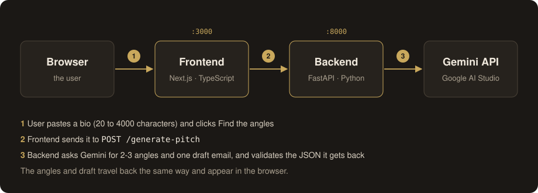

# Find the story


A small tool that takes a musician's bio or update and finds the newsworthy
angle in it, then drafts a pitch email a journalist would actually open.

Built as a scoped demo of AI-directed development: Python/FastAPI backend +
Next.js/TypeScript frontend, calling the Gemini API to do the actual
angle-finding and drafting. A RAG step (Gemini embeddings and a Qdrant vector
database) first matches the bio to the best-fit outlets, so the pitch is written
for a specific one. Runs with a single `docker compose up`, with automated
tests and CI on every pull request.

See [`SPEC.md`](./SPEC.md) for the one-page spec this was built from.

## Why music

I'm a violinist and a web developer, scoped to a domain I actually know: a violinist's bio,
release, or performance update, in this repo's example.

## How it works



1. You paste a bio (20 to 4000 characters) into the frontend.
2. The frontend sends it to `POST /generate-pitch` on the backend.
3. The backend embeds the bio with Gemini embeddings and asks Qdrant for the 3
   closest outlets by cosine similarity (retrieval).
4. The backend asks Gemini for 2-3 newsworthy angles and one draft pitch email
   written for the top-matching outlet (generation), validates the JSON it gets
   back, and returns the angles, draft and matched outlets.
5. The frontend shows the angles, the best-fit outlets and a copyable draft.

The 12 outlets in `backend/outlets.json` are fictional sample data. They are
embedded and stored in Qdrant on the first request, and re-indexed automatically
if the file changes. If Qdrant or the embeddings API is unavailable, matching is
skipped and the pitch is generated without outlets. The similarity scores are in
the API response but not shown in the UI, because they rank outlets rather than
measure how good a match is.

The backend also exposes `GET /health`, and FastAPI's interactive API docs are
at http://localhost:8000/docs when it's running.

## Quick start (Docker)

You need Docker Desktop and a free Gemini API key from
https://aistudio.google.com/apikey (no card required).

```bash
cp .env.example .env        # then paste your key after GEMINI_API_KEY=
docker compose up --build
```

Open http://localhost:3000, paste a bio, click **Find the angles**.
Stop with `Ctrl+C`.

The first request takes a few extra seconds while the outlets are embedded and
stored. You can look at them in the Qdrant dashboard at
http://localhost:6333/dashboard (collection `outlets`).

## Running without Docker

### Backend

```bash
cd backend
pip install -r requirements.txt
export GEMINI_API_KEY=your-key-here
uvicorn main:app --reload --port 8000
```

### Frontend

```bash
cd frontend
npm install
npm run dev
```

The frontend talks to http://localhost:8000 by default. To point it somewhere
else, set `NEXT_PUBLIC_API_URL` before running.

### Outlet matching without Docker Compose (optional)

Without Qdrant the app still works, it just skips outlet matching. To turn it
on, run Qdrant and point the backend at it before starting the backend:

```bash
docker run -p 6333:6333 qdrant/qdrant:v1.19.0
export QDRANT_URL=http://localhost:6333
```

## Configuration

| Variable              | Used by  | Purpose                                                         |
| --------------------- | -------- | --------------------------------------------------------------- |
| `GEMINI_API_KEY`      | backend  | Required. Your Google AI Studio key.                            |
| `CORS_ORIGINS`        | backend  | Comma-separated allowed browser origins. Default: `http://localhost:3000` |
| `QDRANT_URL`          | backend  | Optional. Turns on outlet matching. Set to `http://qdrant:6333` in `docker-compose.yml`; unset means matching is off. |
| `EMBEDDING_MODEL`     | backend  | Optional. Gemini embedding model. Default: `gemini-embedding-001` |
| `NEXT_PUBLIC_API_URL` | frontend | Backend URL. Baked in at build time. Default: `http://localhost:8000` |

## Tests

Neither test suite needs an API key or a running Qdrant. The backend tests mock
the Gemini responses, run Qdrant in memory and use a small stand-in for the
embeddings API. The frontend tests mock `fetch`.

```bash
cd backend && pytest      # API validation, response shape, error handling, outlet matching
cd frontend && npm test   # Jest + React Testing Library: rendering, input, API success/failure, outlets, copy button
```

## Continuous integration

GitHub Actions runs on every pull request and every push to `main`:

- **Backend tests**: installs dependencies and runs `pytest`.
- **Frontend lint and build**: runs `npm run lint`, `npm test` and `npm run build`.
- **Docker images build**: builds the backend and frontend images with `docker compose build`.

There is no automatic deployment yet.

## Roadmap

- Improve match quality: real outlet data, and re-ranking the top results
  (the top scores are often close together).
- Turn the single model call into a small multi-step agent workflow
  (LangGraph): analyse, retrieve, draft, self-critique.
- Deploy a live demo.

## What's out of scope

Sending the email, accounts/persistence, real journalist contact data (the
matched outlets are fictional samples), multi-language support, and visual
polish beyond basic readability.

## A note on process

The backend's `call_gemini` has one deliberate scar left in: the model
occasionally wraps its JSON response in a markdown code fence even with
`response_mime_type` set to JSON. Rather than silently accept that or
hide it, `main.py` strips and retries once, with a comment explaining
why. That's the "caught the AI getting something wrong" moment the spec
calls out.

This project started against the Anthropic API. I switched to Gemini
partway through after hitting a billing wall on a fresh Anthropic
console account — Google AI Studio's free tier has no card requirement
and no expiry, so it let me actually finish and test the app rather than
stall on unrelated account setup. The prompt/response contract and the
rest of the architecture are identical either way; only the client and
model name changed (see the diff in commit history).
